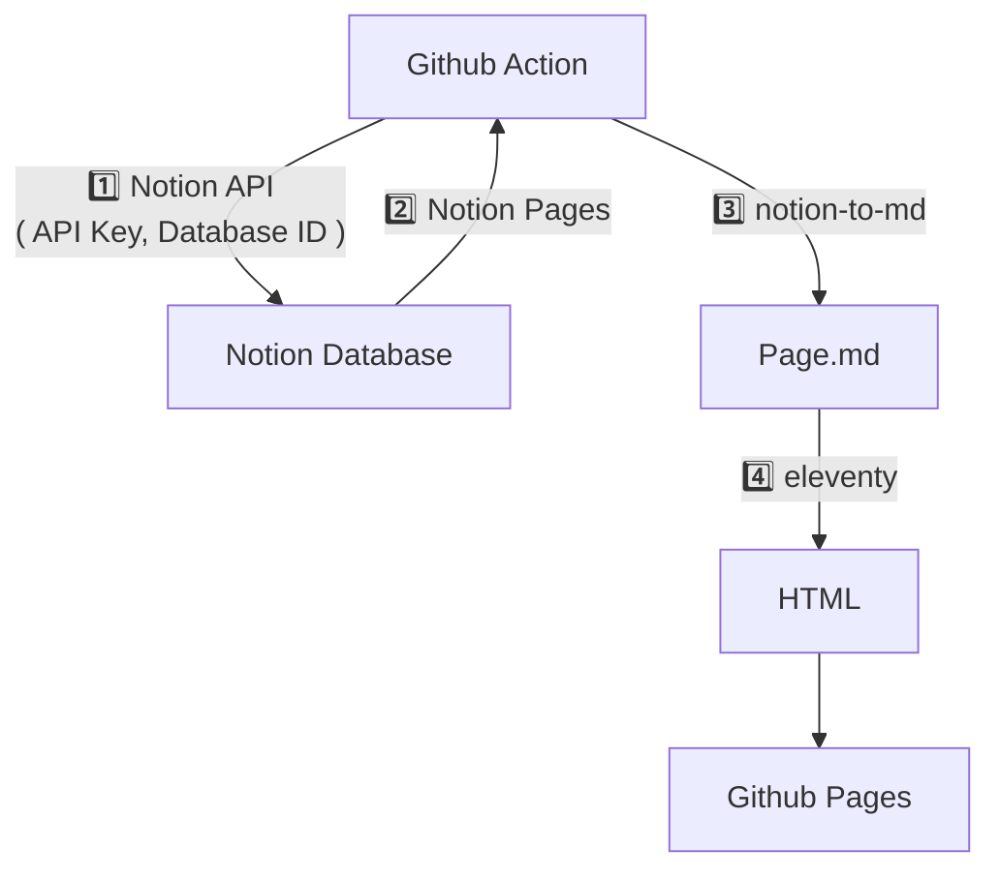

# Eleventy Notion Blog

*"Notion에서 글을 작성하면 Github Blog에 포스팅이 게시되게 할 수 없을까?"*라는 생각과 함께 이 프로젝트가 시작되었습니다.

구글에 *"Github Blog 만들기*"라고 검색할 경우 대부분의 블로거들인 Jekyll을 이용하여 정적 페이지를 생성하고, 마크다운을 이용하여 블로그 글을 작성하라고 소개합니다. 

물론 이 도구는 많은 사람들이 선호하는 도구입니다. 하지만 대부분의 사람들에게는 `Ruby`보다는 `Javascript`가 더 익숙하고, `마크다운`보다 `노션`이 더 편리합니다.
이를 위해 노션 database에 페이지를 추가하여 쓰면 해당 글이 Github Page에 자동으로 포스팅되는 기능을 구현했습니다.

### Notion Database 구조





Notion을 CMS로 사용하는 정적 블로그입니다. Github Actions를 이용하여 notion에서 page들을 다운받아 eleventy로 블로그를 생성하고 github pages에 배포하는 과정을 자동화했습니다.

## 주요 기능
- Notion 데이터베이스의 페이지를 자동으로 가져와 마크다운으로 변환합니다.
- GitHub Actions를 통해 페이지를 가져오고 사이트를 배포하는 과정이 자동화되어 있습니다.

## Notion 데이터베이스 설정
블로그와 연동할 Notion 데이터베이스에는 아래 속성들이 포함되어야 합니다. 이름이 다르면 작동하지 않으니 주의해 주세요.

| 속성명 | 유형 | 설명 |
|---|---|---|
| **이름** | Title | 글 제목 |
| **작성상태** | Status | `작성 완료` 상태인 글만 발행됩니다. |
| **연동일시** | Date | 글 발행 날짜 (비어있으면 페이지 생성일 사용) |
| **요약** | Text | 글 목록에 표시될 짧은 설명 |
| **태그** | Multi-select | 태그 목록 |
| **카테고리** | Select | 카테고리 |
| **썸네일** | URL | (선택사항) 글 목록에 표시될 이미지 주소 |

---

## 사전 준비 : Notion 토큰 및 권한설정 + 데이터베이스 ID 확인

### 1. Notion 토큰 및 권한설정

Notion Developers 사이트에서 통합을 생성하여 얻습니다.
자세한 내용은 [Notion Developers](https://www.notion.so/my-integrations)를 참고해 주세요.

### 2. 데이터베이스 ID 확인

브라우저 주소창이나 페이지 링크 복사를 통해 확인합니다.
자세한 내용은 [Notion API](https://www.notion.so/my-integrations)를 참고해 주세요.

## 사용법 1: 로컬에서 실행하기
개발이나 테스트를 위해 내 컴퓨터에서 실행하는 방법입니다.

### 1. 설치
```bash
git clone https://github.com/minmunui/blog.git
cd blog
npm install
```

### 2. 환경변수 설정
프로젝트 최상위 경로에 `.env` 파일을 생성하고 다음 정보를 입력합니다.
- 토큰은 Notion Developers 사이트에서 통합을 생성하여 얻습니다.
- 데이터베이스 ID는 브라우저 주소창이나 페이지 링크 복사를 통해 확인합니다.

```
NOTION_TOKEN=secret_your_token_here
NOTION_DATABASE_ID=your_database_id_here
```

### 3. 실행
```bash
# Notion에서 글 다운로드
npm run notion

# 개발 서버 실행 (http://localhost:8080)
npm run dev
```

---

## 사용법 2: GitHub Actions로 자동 배포하기
GitHub 저장소에 올리고 자동으로 배포되게 하는 방법입니다. 로컬의 `.env` 파일은 보안상 업로드할 수 없으므로, GitHub의 기능을 이용해 환경변수를 등록해야 합니다.

### 1. Secrets 등록
자신의 GitHub 저장소 페이지에서 다음 메뉴로 이동합니다.
1. 상단의 **Settings** 탭 클릭
2. 왼쪽 메뉴의 **Secrets and variables** > **Actions** 클릭
3. **New repository secret** 버튼 클릭

다음 두 가지 변수를 각각 등록해 주세요. 값은 로컬 `.env`에 적었던 것과 동일합니다.
- **Name**: `NOTION_TOKEN` / **Secret**: (토큰 값 붙여넣기)
- **Name**: `NOTION_DATABASE_ID` / **Secret**: (데이터베이스 ID 붙여넣기)

### 2. 배포
- `main` 브랜치에 코드를 푸시하면 자동으로 Actions가 실행되어 블로그가 배포됩니다.
- Notion에 글을 새로 썼다면, GitHub Actions 탭에서 워크플로우를 수동으로 실행하거나 빈 커밋을 푸시하여 갱신할 수 있습니다.

---

## 사용법 3: 글 발행 및 배포 자동화
Notion에 글을 쓰고 매번 Github에 들어가지 않아도, **원격으로 배포 버튼을 누르거나 자동으로 배포되게 할 수 있습니다.**

### 1. 자동 배포 (매일 자정)
Github Action 동작에 스케줄러를 등록해 두었습니다. 이제 **매일 자정(UTC 00:00, 한국시간 오전 9:00)**에 자동으로 글을 가져와 배포합니다. 급하지 않은 수정사항은 기다리면 반영됩니다.

### 2. 수동 원격 배포 (단축어/외부 호출)
즉시 배포가 필요할 때, Github 웹사이트 접속 없이 URL 호출만으로 배포를 시작할 수 있습니다.

#### 준비물
1. **Github Personal Access Token (PAT)** 생성
   - [Github Token 설정](https://github.com/settings/tokens)
   - `Generate new token` -> `repo` 권한 체크 -> 생성된 토큰 복사

#### 호출 방법 (Curl / 단축어 / n8n)
아래 정보를 사용하여 `POST` 요청을 보내면 배포가 시작됩니다.

- **URL**: `https://api.github.com/repos/[Github아이디]/[저장소이름]/dispatches`
- **Method**: `POST`
- **Body**:
  ```json
  {
    "event_type": "deploy_blog"
  }
  ```
- **Headers**:
  - `Accept`: `application/vnd.github.v3+json`
  - `Authorization`: `token [복사한_GITHUB_TOKEN]`

#### 아이폰/맥 단축어(Shortcuts) 활용
1. 'URL 내용 가져오기' 동작 추가
2. URL에 위 주소 입력 (`[Github아이디]`, `[저장소이름]` 수정)
3. 방법을 `POST`로 변경
4. 헤더 추가 (`Authorization`, `Accept`)
5. 요청 본문을 `JSON`으로 설정하고 `event_type`: `deploy_blog` 추가
6. 이 단축어를 홈 화면에 추가하면 원터치 배포 가능!

---

## 예시
이 코드로 배포된 실제 블로그는 아래 링크에서 확인할 수 있습니다.
https://minmunui.github.io/blog
